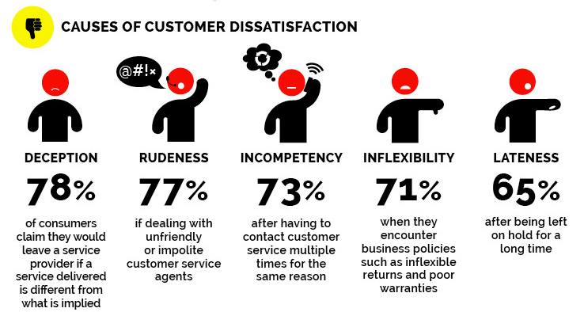

You might hear us talking a lot about WOW'ing our clients (and teammates). It's not just about delivering what was asked for, but also about delivering more than what was expected. It's about going the extra mile to make sure that our clients are always happy and satisfied with our work. It's about creating a lasting impression that will make them want to work with us again and again.

## Why?
- Every client and team mate is different; we must invest in understanding what WOW looks and feels like to them.
- Putting in the effort to WOW supports growth; as individuals and as a team and company.
- It drives long-lasting relationships that helps “secure” business (and revenues) to be invested in the team, company and clients.

:::danger
It is important to be mindful of the trade-off or opportunity cost (eg: doing something new at the cost of other critical things “falling down” - either for the same client or another)
:::

:::caution
There is a fine balance between “WOW’ing” and “over-promising” (or "burning out).
:::

## How?
To truly WOW customers, it's essential to meet and exceed their expectations. Here's how:
- **Be Human** - Whether it is your client or a colleague, all of them have the same basic needs in terms of how they interact - they need human-levels of empathy and communication. Getting on a call and talking things through frequently goes a long, LONG way.
- **Timeliness** - Whether it is the timely delivery of an update or deliverable, timeliness goes a long, LONG way in building trust and confidence.
- It is established and built through consistent behaviours across the team; one-off or sporadic "spurts" of WOW'ing don't cut it.

:::tip
Tip: The proactive communication of updates for work-in-progress (or even foreseen delays) are BEYOND appreciated.
:::

- **Clear information** - We frequently clarify the expectations/wants/needs of our clients. This requires us to "dig deeper" into understanding what our clients want/need and WHY. We do not just repeat what they say; we are more than "parrots".
- **Consistently refining simplicity** - We consistently seek opportunities to simplify by **being more intentional**.  We ensure customers understand what to expect, we avoid using slang/jargons, and we regularly refine communications for refined simplicity.

## What customers expect (and want)

- **Human interactions**
  - With human levels of empathy.
  - We pick up the phone/get on a Zoom call to talk through things that would benefit from being talked through, especially complicated or difficult things.
- **Easy interactions**
  - We’re easy to work with/communicate with.
- **Fast service**
  - We deliver on or (ideally) before the timelines we promise.
  - To achieve this, we add buffer to our estimates/communications with clients but as a team stick to tighter timelines/commitments internally.
- **Supportive interactions**
  - We understand who our client is, what they want, why they want it, when they want it, where they want it, and how they want it (5Ws+1H).
  - We align ourselves, our team, and the service/work we’re delivering to those 5Ws+1H.
- **Clear information**
  - We communicate our expectations/wants/needs of our clients clearly and concisely.
  - We revise these communications as/when we see opportunities to make things even simpler/easier for our clients to understand and follow.

:::caution[What customers don't want]

(Source: [shankmanhonig.com](http://shankmanhonig.com/))
:::

### How do you know if you are WOWing your Clients?
- **Avoid assuming or overestimating**; while 80% of teams believe they provide superior service, only 8% of customers agree. This indicates a significant disconnect. Source: [shankmanhonig.com](http://shankmanhonig.com/).
- Regularly introspect (individually and as a team) and seek timely feedback to gauge client satisfaction and areas for improvement.
- Use Axioned’s WOW Client Feedback Form, along with the related templates and workflow, with a critical eye and clear intent.

### When asking for Client feedback:
- **Ask with intent and curiousity**
- Frame questions that guide the client to provide insightful feedback. For example: Instead of asking, "Are you satisfied with our service?" ask, "How can we improve our service to better meet your needs?". Instead of, "Did you like the recent update?" ask, "What features of the recent update do you feel worked best? What features do you feel need consistent improvement?"
- **Informal feedback**
- Gather feedback during daily or weekly calls. Sometimes this is verbal, sometimes non-verbal. Make sure your request is sincere; showing a true desire to understand and act on their feedback.
- **Create the appropriate setting for feedback**
- Choose the a smaller and focused audience for feedback discussions to avoid putting the client on the spot or making the client uncomfortable.
- **Seek support**
- If unsure, ask teammates or seniors for guidance on how to approach - or action - feedback.

> *“The single biggest problem in communication is the illusion that it has taken place.”*  
> — George Bernard Shaw

## Further (potentially repetitive!) Best Practices

**Design and Deliver**
Create a site/app/product that aligns with the client's 5Ws+1H:
- **What**: Understand what features and functionalities the client desires.
- **Why**: Know the purpose and goals behind their requests.
- **When**: Deliver within the specified timeframe.
- **Where**: Ensure the product is accessible where the client needs it (e.g., mobile, desktop).
- **How**: Follow the client's guidelines and preferences for design and functionality.

**Meet Deadlines**
- Deliver on or before the agreed timelines.
- Understand that customers want fast service and do not tolerate lateness.
- Educate yourself and your team about the concept of “anchoring” to avoid delays.

**Build for Future Maintenance**
- Design products with future maintenance and enhancement in mind.
- Build with empathy for future team members or yourself if someone else needs to take over due to unforeseen circumstances.

**Timely Communication**
- Respond promptly to client communications, especially for highlighted or escalated risks and security concerns.

**Treat Clients as Long-Term Partners**
- Approach clients as long-term partners, not short-term customers.
- Invest in understanding their goals, vision, pain points, and frustrations.
- Dedicate time to find solutions that meet their needs and solve their problems.

**Follow Client Preferences**
- Use the “How to Work With Me” (HTWwM) cheat sheet to adhere to clients' communication preferences.
- If unclear, ask further questions to ensure you understand their preferences.

**Request and Act on Feedback**
- Seek client feedback early in the engagement.
- Act on the feedback provided before requesting further input.
