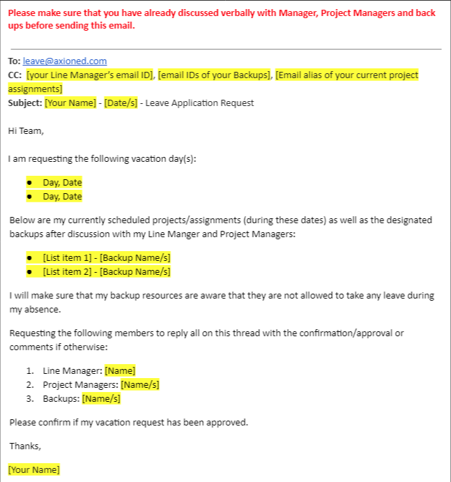

# Planned Leave Application and Approval Guidelines

We all benefit when planned leaves are handled smoothly — it helps teams stay prepared, ensures fair workload distribution. This quick guide outlines what's expected from both leave requestors and approvers to keep things running seamlessly.

## For Leave Requestors:
If you're planning to take some time off:
- Try to **submit your leave request at least 14 calendar days in advance**.
  
- Use the **Leave Request Template** — it helps everyone stay in the loop and plan better.  
  Make sure to include:
  - Your **leave start and end dates.**
  - Names of your **backup team members.**
  - Approval from the Line Manager, Project Manager, and Backup team members.

## For Leave Approvers:
If you're the one reviewing leave requests:
- Aim to **review and approve them at least 3 working days before** the leave is set to begin.
  
- If you need more time (say, you're waiting on a client or project update), just **let the requestor know** the reason and when they can expect a final response.
  
- If the request is still pending **2 working days before the leave start date**, the requestor is encouraged to flag it to their functional head and/or HR so it can be addressed in time.