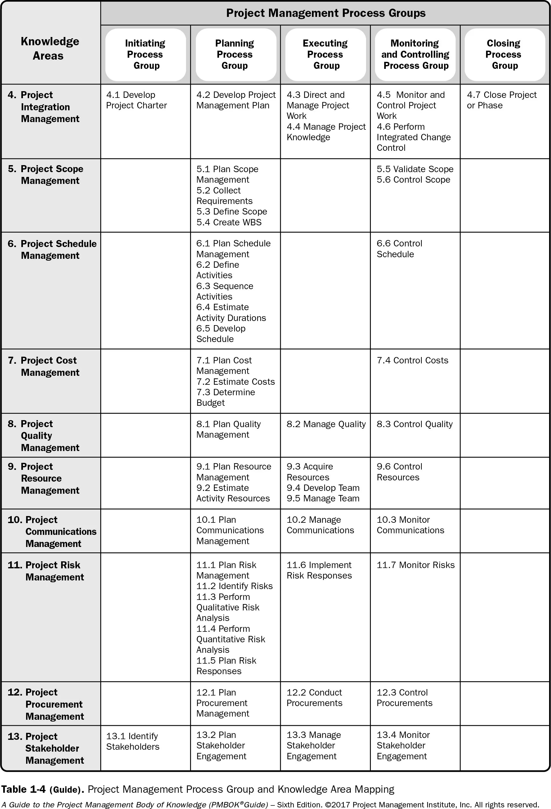

# What is a "Project"?
A project is a temporary endeavor undertaken to create a unique product, service, or result. It is a set of coordinated and controlled activities with a beginning and an end, designed to achieve specific goals and objectives. Projects are typically used to achieve business goals and objectives, such as increasing revenue, improving efficiency, or developing new products or services.

Projects have some key characteristics that set them apart from ongoing operations or business as usual: they are unique and have a defined beginning and end; they involve a team of people with specific roles and responsibilities; they require the allocation of resources (such as time, money, and materials); and they are subject to constraints such as budget and schedule.

Projects can vary greatly in size, complexity, and scope, but they all involve planning, executing, monitoring and controlling, and closing activities to achieve specific goals and objectives.

**Examples of projects include but are not limited to:**
- Developing a new pharmaceutical compound for market,
- Expanding a tour guide service,
- Merging two organizations,
- Improving a business process within an organization,
- Acquiring and installing a new computer hardware system for use in an organization,
- Exploring for oil in a region,
- Modifying a computer software program used in an organization,
- Conducting research to develop a new manufacturing process, and
- Constructing a building.

**Temporary endeavor.** The temporary nature of projects indicates that a project has a definite beginning and end. 
Temporary does not necessarily mean a project has a short duration. The end of the project is reached when one 
or more of the following is true:
- The project’s objectives have been achieved;
- The objectives will not or cannot be met;
- Funding is exhausted or no longer available for allocation to the project;
- The need for the project no longer exists (e.g., the customer no longer wants the project completed, a change 
in strategy or priority ends the project, the organizational management provides direction to end the project); 
- The human or physical resources are no longer available; or
- The project is terminated for legal cause or convenience

**Projects enable business value creation**
Business value in projects refers to the benefit that the results of a specific project provide to its stakeholders. 
The benefit from projects may be tangible, intangible, or both.

*Examples of tangible elements include:*
- Monetary assets,
- Stockholder equity,
- Utility,
- Fixtures,
- Tools, and
- Market share.

*Examples of intangible elements include:*
- Goodwill,
- Brand recognition,
- Public benefit,
- Trademarks,
- Strategic alignment, and
- Reputation

## The Importance of Project Management
Project management is the application of knowledge, skills, tools, and techniques to project activities to meet the project requirements. Project management is accomplished through the appropriate application and integration of the project management processes identified for the project. Project management enables organizations to execute projects 
effectively and efficiently.

*Effective project management helps individuals, groups, and public and private organizations to:*
- Meet business objectives;
- Satisfy stakeholder expectations;
- Be more predictable;
- Increase chances of success;
- Deliver the right products at the right time;
- Resolve problems and issues;
- Respond to risks in a timely manner;
- Optimize the use of organizational resources;
- Identify, recover, or terminate failing projects;
- Manage constraints (e.g., scope, quality, schedule, costs, resources);
- Balance the influence of constraints on the project (e.g., increased scope may increase cost or schedule); and
- Manage change in a better manner

*Poorly managed projects or the absence of project management may result in:*
- Missed deadlines,
- Cost overruns,
- Poor quality,
- Rework,
- Uncontrolled expansion of the project,
- Loss of reputation for the organization,
- Unsatisfied stakeholders, and
- Failure in achieving the objectives for which the project was undertaken

### Operations Management
Operations management is concerned with the ongoing production of goods and/or services. It ensures that business operations continue efficiently by using the optimal resources needed to meet customer demands. It is concerned with managing processes that transform inputs (e.g., materials, components, energy, and labor) into outputs (e.g., products, goods, and/or services).

### PROJECT MANAGEMENT PROCESS GROUPS
A Project Management Process Group is a logical grouping of project management processes to achieve specific project objectives. Process Groups are independent of project phases.

Project management processes are grouped into the following five Project Management Process Groups:

-  **Initiating Process Group.** Those processes performed to define a new project or a new phase of an existing project by obtaining authorization to start the project or phase.

-  **Planning Process Group.** Those processes required to establish the scope of the project, refine the objectives, and define the course of action required to attain the objectives that the project was undertaken to achieve.

-  **Executing Process Group.** Those processes performed to complete the work defined in the project management plan to satisfy the project requirements.

-  **Monitoring and Controlling Process Group.** Those processes required to track, review, and regulate the progress and performance of the project; identify any areas in which changes to the plan are required; and initiate the corresponding changes.

-  **Closing Process Group.** Those processes performed to formally complete or close the project, phase, or contract.

These process groups are interrelated and overlap through the project life cycle, but they are distinct and unique in their objectives and their focus on specific activities.

### PROJECT MANAGEMENT KNOWLEDGE AREAS
In addition to Process Groups, processes are also categorized by Knowledge Areas. A Knowledge Area is an identified area of project management defined by its knowledge requirements and described in terms of its component processes, practices, inputs, outputs, tools, and techniques.

1. Project Integration Management
2. Project Scope Management
3. Project Time Management
4. Project Cost Management
5. Project Quality Management
6. Project Resource Management
7. Project Communication Management
8. Project Risk Management
9. Project Procurement Management
10. Project Stakeholder Management.

Project management knowledge areas refer to the specific areas of expertise that project managers must be familiar with in order to effectively plan and execute a project. 

[PMBOK® Guide 6th Edition Knowledge Areas for Project Management - Process Groups and Processes - The Complete Guide](https://www.project-management-prepcast.com/pmbok-knowledge-areas-and-pmi-process-groups)

### PROJECT MANAGEMENT DATA AND INFORMATION

Project management data and information refers to all of the data and information that is collected, generated, or used throughout the project management process. This can include project plans, schedules, budgets, project documentation, meeting minutes, communications, and other project-related data. For example, during the planning phase of a construction project, the project manager may collect data on the cost of materials and labor, as well as information on the project schedule and any potential risks that may impact the project. This information is then used to create project plans and schedules, and to monitor and control the project as it progresses.